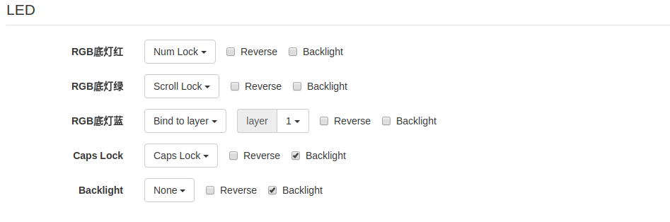

# XD64

## Flash procedure

+ [KLE](http://www.keyboard-layout-editor.com/#/gists/a70e36b93cde065a17f6ec2c734646b0)
+ [Required plugin](https://chrome.google.com/webstore/detail/tkg-chrome-app/kmbmjdabhpdnpeobnbdchihdcdaccidi)
+ Use [yang.tkg.io](http://yang.tkg.io/)
+ Keyboard : ```GH60 (RevXD_Mod)```
+ Layer : ```Simple```
+ Copy KLE link to yang.tkg.io
+ ```Import Fn```, then paste ***KLE** Keyboard Properties* tab content
+ Connect Keyboard while pressing ```Space``` and ```B```
+ Set Bootloader : ```DFU```
+ Click ```Burn .eep```

## LED

